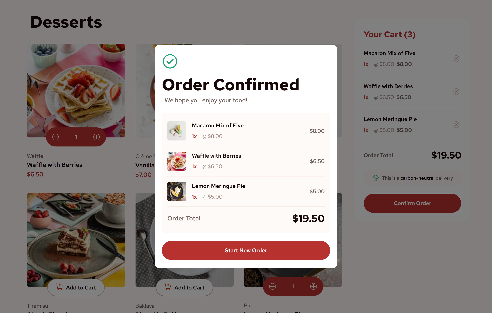
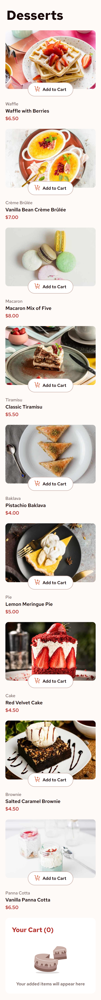
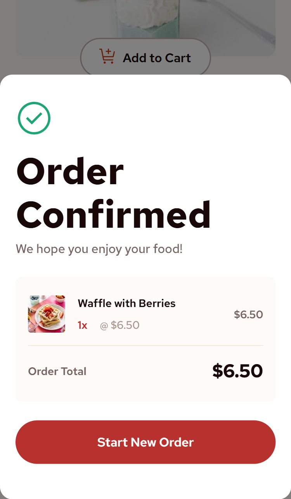

# Frontend Mentor - Product list with cart solution

This is a solution to the [Product list with cart challenge on Frontend Mentor](https://www.frontendmentor.io/challenges/product-list-with-cart-5MmqLVAp_d). Frontend Mentor challenges help you improve your coding skills by building realistic projects.

## Table of contents

- [Overview](#overview)
  - [The challenge](#the-challenge)
  - [Screenshot](#screenshot)
  - [Links](#links)
- [My process](#my-process)
  - [Built with](#built-with)
  - [What I learned](#what-i-learned)
  - [Continued development](#continued-development)
  - [Useful resources](#useful-resources)
- [Author](#author)
- [Acknowledgments](#acknowledgments)

## Overview

### The challenge

Users should be able to:

- Add items to the cart and remove them
- Increase/decrease the number of items in the cart
- See an order confirmation modal when they click "Confirm Order"
- Reset their selections when they click "Start New Order"
- View the optimal layout for the interface depending on their device's screen size
- See hover and focus states for all interactive elements on the page

### Screenshot

- Desktop version.  
  

  

- Mobile version.  
  

  

### Links

- Solution URL: [Github](https://github.com/Abaljerind/product-list-with-card)
- Live Site URL: [Live Site](https://product-list-with-card-chi.vercel.app/)

## My process

### Built with

- Semantic HTML5 markup
- Flexbox
- Mobile-first workflow
- [React](https://reactjs.org/) - JS library
- [Vite](https://vite.dev/) - React framework
- [TailwindCSS](https://tailwindcss.com/) - CSS framework

### What I learned

I really learn a lot with React JS and TailwindCSS, cause at first I thought codes like the one below here where I can add div and styles with TailwindCSS to wrap a component instance, can't be used or unorthodox, but I'm just glad my thought's wrong.

See below:

```html
<h1>Some codes I've learned</h1>
```

```js
{
  isOrderConfirmed && (
    <div className="fixed inset-0 z-[999] flex h-full w-full items-center justify-center bg-black/50">
      <OrderConfirmed
        cart={cart}
        totalPrice={totalPrice}
        onNewOrder={onNewOrder}
      />
    </div>
  );
}
```

### Continued development

Perhaps in the future, I will use global context or component composition so it won't use props drilling like this one. But right now I'm still in the process to learning React, so it won't be long.

### Useful resources

- [TailwindCSS](https://tailwindcss.com/) - This helped me to do the styling more easy. I really liked this bootstrap and will use it going forward.
- [Vercel](https://vercel.com) - This is an amazing website which helped me to upload my website into the internet. I'd recommend it to anyone still learning to use this website.

## Author

- Frontend Mentor - [@Abaljerind](https://www.frontendmentor.io/profile/Abaljerind)
- Github - [@Abaljerind](https://github.com/Abaljerind)

## Acknowledgments

I want to thank me for believing in me, I want to thank me for doing all this hard work. I wanna thank me for having no days off. I wanna thank me for never quitting. I wanna thank me for being me at all times.
